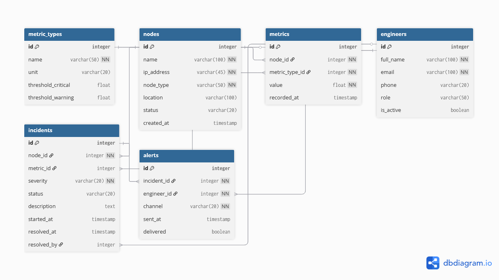

# Мониторинг сети — РГР по Базам Данных

## Предметная область
Система мониторинга сетевой инфраструктуры: узлы (серверы, роутеры, коммутаторы), 
сбор метрик (CPU, ping, температура), регистрация аварий и отправка оповещений дежурным инженерам.

## ER-диаграмма


## Ограничения целостности

| Тип | Где | Зачем |
|-----|-----|-------|
| PRIMARY KEY | Во всех таблицах | Уникальность записей |
| FOREIGN KEY | metrics, incidents, alerts | Связи между таблицами |
| UNIQUE | nodes.ip_address, engineers.email | Уникальность ключевых полей |
| CHECK (status) | nodes, incidents | Допустимые значения статусов |
| CHECK (severity) | incidents | Допустимые уровни критичности |
| CHECK (value &gt;= 0) | metrics | Метрики неотрицательны |
| CHECK (resolved_at &gt; started_at) | incidents | Логика времени |

## Индексы

| Индекс | Поля | Зачем |
|--------|------|-------|
| idx_metrics_node_time | metrics(node_id, recorded_at) | Быстрый поиск метрик по узлу и времени |
| idx_incidents_status_severity | incidents(status, severity) | Фильтрация аварий по статусу и критичности |
| idx_alerts_sent_at | alerts(sent_at) | Аналитика по времени оповещений |

## Запуск

```bash
psql -U postgres
CREATE DATABASE network_monitoring;
\c network_monitoring
\i schema.sql
\i data.sql
\i queries.sql